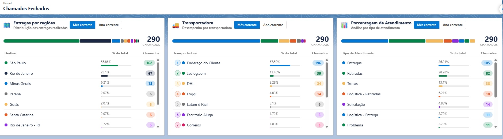

# Dashboard Atendimento SF

Dashboard operacional desenvolvido em Salesforce Lightning Web Components que centraliza em uma única tela os principais indicadores de chamados fechados, oferecendo aos gestores uma visão clara e em tempo real do desempenho da operação.



---

## Sobre o projeto

A ideia surgiu da necessidade de ter uma visão consolidada dos chamados de logística sem precisar ficar abrindo relatório por relatório no Salesforce. O dashboard reúne três perspectivas diferentes em uma única tela: de onde vêm os chamados (por estado), quais transportadoras estão sendo mais acionadas e qual é o mix de tipos de atendimento.

Tudo isso com filtro de período (mês corrente ou ano corrente), atualização automática a cada 5 minutos e a possibilidade de clicar em qualquer item para ver os chamados relacionados.

---

## Funcionalidades

- **Entregas por regiões** — distribuição dos chamados fechados por estado, com percentual e quantidade. Clicando em um estado abre a lista de chamados daquele UF com cidade, transportadora e data.
- **Transportadora** — ranking das transportadoras por volume de chamados fechados. Clicando em uma transportadora abre os chamados vinculados a ela.
- **Porcentagem de Atendimento** — breakdown por tipo de atendimento (Entregas, Retiradas, Trocas, etc.) com percentual visual. Também clicável para ver os chamados de cada tipo.
- Filtro por **Mês corrente** ou **Ano corrente** em cada card de forma independente
- Barra colorida proporcional ao volume de cada item
- Atualização automática silenciosa a cada 5 minutos via `refreshApex`

---

## Stack técnica

- **Lightning Web Components (LWC)** — um componente wrapper (`logisticaDashboard`) que organiza os três cards em grid, cada card é um LWC independente com seu próprio estado e ciclo de vida
- **Apex** — controller único (`LogisticaDashboardController`) com métodos `@AuraEnabled(cacheable=true)` e queries com `GROUP BY` para agregar os dados
- **SOQL** — todas as queries usam `WITH USER_MODE` para respeitar as permissões do usuário logado e filtram por `CreatedDate >= :startDate` com a data calculada em Apex
- **NavigationMixin** — para navegar diretamente ao record do chamado a partir do modal
- **`@wire` reativo** — o parâmetro `$_period` no wire adapter faz a query ser refeita automaticamente toda vez que o usuário troca o período

---

## Estrutura dos componentes

```
force-app/main/default/
├── classes/
│   ├── LogisticaDashboardController.cls       # Controller Apex com todos os métodos
│   └── LogisticaDashboardControllerTest.cls   # Testes com SeeAllData=true
└── lwc/
    ├── logisticaDashboard/                    # Wrapper — grid dos 3 cards
    ├── logisticaDestino/                      # Card entregas por estado + modal
    ├── logisticaTransportadora/               # Card transportadoras + modal com ranking
    └── porcentagemDeAtendimento/              # Card tipos de atendimento + modal
```

---

## Como fazer o deploy

Pré-requisitos: Salesforce CLI instalado e org autenticada.

```bash
# Deploy completo
sf project deploy start \
  --source-dir force-app/main/default/classes \
  --source-dir force-app/main/default/lwc \
  --target-org <alias-da-org> \
  --test-level RunSpecifiedTests \
  --tests LogisticaDashboardControllerTest
```

Depois de fazer o deploy, adicione o componente `logisticaDashboard` em uma Lightning App Page pelo App Builder.

---

## Filtros aplicados nas queries

| Filtro | Valor |
|---|---|
| Status | Fechado |
| Período | Mês corrente ou Ano corrente (calculado em Apex) |
| Transportadoras | Lista fixa com as transportadoras da operação |
| Tipos de atendimento | Entregas, Retiradas, Trocas, Logística - Entrega, Logística - Retiradas, Problema, Solicitação, Pendência, Software, Assistência Técnica, Migração, Movimentação Interna |

---

## Observações

- Os testes usam `@IsTest(SeeAllData=true)` pois dependem de dados reais da org para validar os retornos
- O auto-refresh é de 5 minutos (`REFRESH_INTERVAL_MS = 5 * 60 * 1000`) e não exibe nenhuma indicação visual para o usuário — simplesmente atualiza os dados em background
- As cores dos itens são atribuídas sequencialmente a partir de um array fixo de cores definido em cada componente JS
